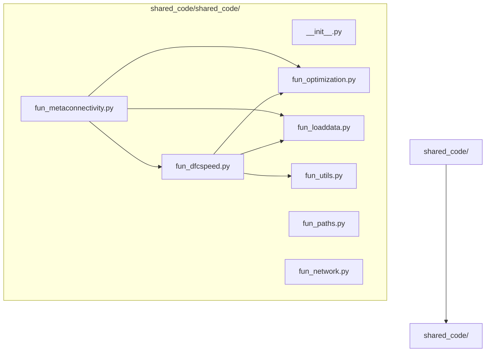

# Folder Map (Slim)

A minimal diagram focused on the installable shared_code package and its core internals.

```mermaid
graph TD
  SC[shared_code/]
  SC --> PKG[shared_code/]
  
  subgraph PKGDIR[shared_code/shared_code/]
    INIT[__init__.py]
    DFCS[fun_dfcspeed.py]
    UTIL[fun_utils.py]
    OPT[fun_optimization.py]
    LOAD[fun_loaddata.py]
    META[fun_metaconnectivity.py]
    PATHS[fun_paths.py]
    NET[fun_network.py]
  end

  %% Core dependencies
  DFCS --> OPT
  DFCS --> LOAD
  DFCS --> UTIL

  META --> DFCS
  META --> LOAD
  META --> OPT
```
