# Project Inventory

This document summarizes the repository structure, key modules, entrypoints, large data/cache directories, a high‑level dependency graph, and longest Python files.

## Top‑Level Folders

Present among common project folders of interest:

- shared_code/
- allegiance/
- metaconnectivity/
- julien_data/

Other notable items:

- .vscode/
- README.md and test_*.py scripts

## Tree: selected folders

### shared_code/

```
shared_code/
├─ README.md
├─ SCIENTIFIC_CODING_GUIDELINES.md
├─ setup.py
├─ shared_code/
│  ├─ __init__.py
│  ├─ fun_bootstrap.py
│  ├─ fun_dfcspeed.py
│  ├─ fun_loaddata.py
│  ├─ fun_metaconnectivity.py
│  ├─ fun_network.py
│  ├─ fun_optimization.py
│  ├─ fun_paths.py
│  └─ fun_utils.py
└─ shared_code.egg-info/
```

### allegiance/src/

```
allegiance/src/
├─ 1_preprocessed_data_ts_cog_groups.py
├─ 2_compute_dfc_local.py
├─ allegiance_per_animal.py
├─ allegiance_per_animal_v2.py
├─ burst_detection_PBM.py
├─ compute_allegiance_local.py
├─ merge_allegiance_parallel.py
├─ run_all_allegiance_local.py
└─ test_plt.py
```

### metaconnectivity/

```
metaconnectivity/
├─ cognitive_data_ts_sorted.py
├─ compute_fluidity.py
├─ compute_metaconnectivity_modularity.py
├─ compute_trimers.py
├─ deprecated_fun.py
├─ fun_dfcspeed.py
├─ fun_loaddata.py
├─ fun_metaconnectivity.py
├─ fun_optimization.py
├─ fun_utils.py
└─ master_mc.py
```

### julien_data/

```
julien_data/
├─ 1_preprocess_data_ts_cog.py
├─ 2_compute_dfc_stream.py
├─ 3_dfc_local_speed_v1.py
├─ 3_dfc_speed_test.py
├─ 3_dfc_speed_test_v6.py
├─ class_dataanalysis_julien.py
├─ demo_before_after.py
├─ demo_improved_system.py
├─ demo_practical_usage.py
├─ dfc_windows_pooling.py
├─ fig/
├─ figure_dfc_cog_composite*.{png,svg}
├─ laod_las_speed.py
├─ local_speed_plot.py
├─ local_speed_plot_v2.py
├─ modularity.py
├─ plot_cog_data.py
├─ Plot_speed_figures.py
├─ plots.py
├─ plots_speed.ipynb
├─ plts_speed.py
├─ PROJECT_SUMMARY.md
├─ results/
├─ simple_speed_analysis.py
├─ test_func_speed.py
├─ test_improved_functions.py
└─ test_speed_results/
```

## Key Python Packages/Modules

### Under shared_code/

- Package: `shared_code` (installable via `shared_code/setup.py`)
  - Modules: `fun_bootstrap`, `fun_dfcspeed`, `fun_loaddata`, `fun_metaconnectivity`, `fun_network`, `fun_optimization`, `fun_paths`, `fun_utils`.

### Under src/

- No top‑level `src/` directory detected.
  - Note: there is a nested `allegiance/src/` directory with analysis scripts; not part of a top‑level `src/` package.

### Under allegiance/src/ (scripts)

- `compute_allegiance_local.py`, `2_compute_dfc_local.py`, `allegiance_per_animal.py`, `allegiance_per_animal_v2.py`, `burst_detection_PBM.py`, `merge_allegiance_parallel.py`, `run_all_allegiance_local.py`, `1_preprocessed_data_ts_cog_groups.py`, `test_plt.py`.

### Under metaconnectivity/ (scripts and legacy modules)

- `compute_fluidity.py`, `compute_metaconnectivity_modularity.py`, `compute_trimers.py`, `cognitive_data_ts_sorted.py`, plus legacy `fun_*` modules mirroring `shared_code`.

### Under julien_data/ (analysis/demo scripts)

- Core scripts: `1_preprocess_data_ts_cog.py`, `2_compute_dfc_stream.py`, `dfc_windows_pooling.py`, `modularity.py`, plotting utilities (`plots.py`, `plot_cog_data.py`, `local_speed_plot*.py`), demos and tests.

## Entrypoints and Notebooks

- Entrypoint scripts (detected via `if __name__ == "__main__"`, excluding vendored/venv):
  - `test_unified_dfc_speed.py`
  - `test_compatibility.py`
  - `test_dfc_speed_integration.py`
  - `julien_data/1_preprocess_data_ts_cog.py`
  - `julien_data/simple_speed_analysis.py`
  - `allegiance/src/merge_allegiance_parallel.py`

- Notebooks:
  - `julien_data/plots_speed.ipynb`

## Large Data/Cache Directories (>50 MB)

- `allegiance/env` ~ 482 MB (Python virtual environment)
- `julien_data/results` ~ 59 MB
- Aggregate folder sizes for context:
  - `allegiance/` ~ 483 MB (dominated by `env/`)
  - `julien_data/` ~ 79 MB

## Mermaid Dependency Graph (modules)

The graph captures internal imports within `shared_code` and how scripts in allegiance/src, metaconnectivity/, and julien_data/ depend on it.

```mermaid
graph TD
  SC_init[shared_code.__init__]
  SC_utils[shared_code.fun_utils]
  SC_opt[shared_code.fun_optimization]
  SC_load[shared_code.fun_loaddata]
  SC_dfcs[shared_code.fun_dfcspeed]
  SC_meta[shared_code.fun_metaconnectivity]
  SC_boot[shared_code.fun_bootstrap]
  SC_net[shared_code.fun_network]
  SC_paths[shared_code.fun_paths]

  %% Allegiance scripts
  A_comp_loc[allegiance.src.compute_allegiance_local]
  A_dfc_local[allegiance.src.2_compute_dfc_local]
  A_animal[allegiance.src.allegiance_per_animal]
  A_animal2[allegiance.src.allegiance_per_animal_v2]
  A_burst[allegiance.src.burst_detection_PBM]
  A_merge[allegiance.src.merge_allegiance_parallel]
  A_run_all[allegiance.src.run_all_allegiance_local]
  A_preproc[allegiance.src.1_preprocessed_data_ts_cog_groups]

  %% Metaconnectivity scripts
  M_fluid[metaconnectivity.compute_fluidity]
  M_mod[metaconnectivity.compute_metaconnectivity_modularity]
  M_cog[metaconnectivity.cognitive_data_ts_sorted]

  %% Julien scripts (subset)
  J_plots[julien_data.plots]
  J_mod[julien_data.modularity]
  J_stream[julien_data.2_compute_dfc_stream]
  J_preproc[julien_data.1_preprocess_data_ts_cog]
  J_pool[julien_data.dfc_windows_pooling]

  %% __init__ aggregates re‑exports
  SC_init --> SC_boot
  SC_init --> SC_dfcs
  SC_init --> SC_load
  SC_init --> SC_meta
  SC_init --> SC_net
  SC_init --> SC_opt
  SC_init --> SC_utils
  SC_init --> SC_paths

  %% Core dependencies
  SC_dfcs --> SC_opt
  SC_dfcs --> SC_load
  SC_dfcs --> SC_utils

  SC_meta --> SC_dfcs
  SC_meta --> SC_load
  SC_meta --> SC_opt

  %% Allegiance -> shared_code
  A_comp_loc --> SC_load
  A_comp_loc --> SC_dfcs
  A_comp_loc --> SC_meta
  A_comp_loc --> SC_utils
  A_comp_loc --> SC_paths

  A_dfc_local --> SC_load
  A_dfc_local --> SC_dfcs
  A_dfc_local --> SC_meta
  A_dfc_local --> SC_utils
  A_dfc_local --> SC_paths

  A_animal --> SC_meta
  A_animal --> SC_paths
  A_animal2 --> SC_meta
  A_animal2 --> SC_paths
  A_burst --> SC_utils
  A_burst --> SC_paths
  A_burst --> SC_dfcs
  A_merge --> SC_paths
  A_merge --> SC_meta
  A_run_all --> SC_utils
  A_run_all --> SC_paths
  A_run_all --> SC_meta
  A_preproc --> SC_load
  A_preproc --> SC_utils
  A_preproc --> SC_paths

  %% Metaconnectivity -> shared_code
  M_fluid --> SC_load
  M_fluid --> SC_dfcs
  M_fluid --> SC_meta
  M_fluid --> SC_utils
  M_fluid --> SC_paths
  M_mod --> SC_load
  M_mod --> SC_dfcs
  M_mod --> SC_meta
  M_mod --> SC_utils
  M_mod --> SC_paths
  M_cog --> SC_load
  M_cog --> SC_utils
  M_cog --> SC_paths

  %% Julien -> shared_code
  J_plots --> SC_load
  J_plots --> SC_dfcs
  J_plots --> SC_utils
  J_plots --> SC_paths
  J_mod --> SC_load
  J_mod --> SC_utils
  J_mod --> SC_dfcs
  J_mod --> SC_meta
  J_stream --> SC_load
  J_stream --> SC_dfcs
  J_stream --> SC_paths
  J_preproc --> SC_load
  J_preproc --> SC_utils
  J_preproc --> SC_paths
  J_pool --> SC_load
  J_pool --> SC_dfcs
  J_pool --> SC_boot
  J_pool --> SC_utils
  J_pool --> SC_paths
```



## Script → Module Map

High‑level mapping of analysis scripts to the `shared_code` modules they import.

### allegiance/src

- 1_preprocessed_data_ts_cog_groups.py: fun_loaddata, fun_utils, fun_paths
- 2_compute_dfc_local.py: fun_loaddata, fun_dfcspeed, fun_metaconnectivity, fun_utils, fun_paths
- allegiance_per_animal.py: fun_metaconnectivity, fun_paths
- allegiance_per_animal_v2.py: fun_metaconnectivity, fun_paths
- burst_detection_PBM.py: fun_utils, fun_paths, fun_dfcspeed
- compute_allegiance_local.py: fun_loaddata, fun_dfcspeed, fun_metaconnectivity, fun_utils, fun_paths
- merge_allegiance_parallel.py: fun_paths, fun_metaconnectivity
- run_all_allegiance_local.py: fun_utils, fun_paths, fun_metaconnectivity
- test_plt.py: fun_paths, fun_metaconnectivity

### metaconnectivity

- cognitive_data_ts_sorted.py: fun_loaddata, fun_utils, fun_paths
- compute_fluidity.py: fun_loaddata, fun_dfcspeed, fun_metaconnectivity, fun_utils, fun_paths
- compute_metaconnectivity_modularity.py: fun_loaddata, fun_dfcspeed, fun_metaconnectivity, fun_utils, fun_paths
- compute_trimers.py: (no direct shared_code imports detected)
- deprecated_fun.py: (legacy helpers; not scanned for shared_code)
- master_mc.py: fun_utils (filename_sort_mat, …)

### julien_data

- 1_preprocess_data_ts_cog.py: fun_loaddata, fun_utils, fun_paths
- 2_compute_dfc_stream.py: fun_loaddata, fun_dfcspeed (get_tenet4window_range), fun_paths
- 3_dfc_local_speed_v1.py: fun_loaddata, fun_utils (also uses fun_optimization within functions)
- 3_dfc_speed_test_v6.py: fun_loaddata, fun_utils (also uses fun_optimization within functions)
- class_dataanalysis_julien.py: fun_paths, fun_loaddata (also loads via shared_code.fun_loaddata)
- dfc_windows_pooling.py: fun_loaddata, fun_dfcspeed (pool_vel_windows, get_population_wpooling), fun_bootstrap, fun_utils, fun_paths
- modularity.py: fun_loaddata, fun_utils, fun_dfcspeed (ts2fc, ts2dfc_stream), fun_metaconnectivity
- plot_cog_data.py: fun_utils, fun_paths
- plots.py: fun_loaddata, fun_dfcspeed (parallel_dfc_speed_oversampled_series), fun_utils, fun_paths, shared_code.fun_dfcspeed (get_tenet4window_range)
- plts_speed.py: fun_paths, fun_loaddata
- test_func_speed.py: fun_dfcspeed, fun_optimization (used in tests)

Notes:
- Some julien_data scripts import via the long path `shared_code.*`; this resolves to the same installed package.

## Folder Map (Mermaid)

High-level directory structure with key subfolders and representative files.

```mermaid
graph TD
  R[PROJECT_ROOT]

  R --> SC[shared_code/]
  subgraph SCG[shared_code/]
    SC --> SC_README[README.md]
    SC --> SC_PKG[shared_code/]
    SC --> SC_SETUP[setup.py]
    subgraph SCPKG[shared_code/shared_code/]
      SC_PKG --> SC_INIT[__init__.py]
      SC_PKG --> SC_DFCS[fun_dfcspeed.py]
      SC_PKG --> SC_UTIL[fun_utils.py]
      SC_PKG --> SC_OPT[fun_optimization.py]
      SC_PKG --> SC_LOAD[fun_loaddata.py]
      SC_PKG --> SC_META[fun_metaconnectivity.py]
      SC_PKG --> SC_PATHS[fun_paths.py]
      SC_PKG --> SC_NET[fun_network.py]
    end
  end

  R --> ALG[allegiance/]
  subgraph ALGG[allegiance/]
    ALG --> ALG_SRC[src/]
    ALG --> ALG_ENV[env/ (virtual env)]
    subgraph ALGSRC[allegiance/src/]
      ALG_SRC --> A1[1_preprocessed_data_ts_cog_groups.py]
      ALG_SRC --> A2[2_compute_dfc_local.py]
      ALG_SRC --> AA[allegiance_per_animal.py]
      ALG_SRC --> AAv2[allegiance_per_animal_v2.py]
      ALG_SRC --> AB[burst_detection_PBM.py]
      ALG_SRC --> ACL[compute_allegiance_local.py]
      ALG_SRC --> AM[merge_allegiance_parallel.py]
      ALG_SRC --> AR[run_all_allegiance_local.py]
    end
  end

  R --> MC[metaconnectivity/]
  subgraph MCG[metaconnectivity/]
    MC --> MC_CF[compute_fluidity.py]
    MC --> MC_CM[compute_metaconnectivity_modularity.py]
    MC --> MC_CT[compute_trimers.py]
    MC --> MC_COG[cognitive_data_ts_sorted.py]
    MC --> MC_FUN[fun_*.py (legacy)]
  end

  R --> JD[julien_data/]
  subgraph JDG[julien_data/]
    JD --> JD_RES[results/ (~59MB)]
    JD --> JD_FIG[fig/]
    JD --> JD_NOTE[plots_speed.ipynb]
    JD --> JD_S1[1_preprocess_data_ts_cog.py]
    JD --> JD_S2[2_compute_dfc_stream.py]
    JD --> JD_POOL[dfc_windows_pooling.py]
    JD --> JD_MOD[modularity.py]
    JD --> JD_PLOTS[plots.py]
    JD --> JD_LP[local_speed_plot*.py]
  end

  R --> MC2[metaconnectivity/]
  R --> VS[.vscode/]
  R --> READ[README.md]
  R --> TESTS[test_*.py]
```

## 20 Longest Python Files (by lines)

| Lines | File |
|---:|:---|
| 2517 | julien_data/local_speed_plot_v2.py |
| 1486 | julien_data/local_speed_plot.py |
| 1396 | julien_data/laod_las_speed.py |
| 1255 | allegiance/src/allegiance_per_animal_v2.py |
| 1037 | julien_data/plot_cog_data.py |
| 1007 | julien_data/class_dataanalysis_julien.py |
| 893 | allegiance/src/allegiance_per_animal.py |
| 841 | shared_code/shared_code/fun_dfcspeed.py |
| 823 | shared_code/shared_code/fun_metaconnectivity.py |
| 769 | metaconnectivity/fun_metaconnectivity.py |
| 630 | julien_data/dfc_windows_pooling.py |
| 576 | julien_data/3_dfc_local_speed_v1.py |
| 528 | allegiance/src/burst_detection_PBM.py |
| 497 | shared_code/shared_code/fun_utils.py |
| 439 | metaconnectivity/fun_dfcspeed.py |
| 390 | julien_data/3_dfc_speed_test_v6.py |
| 388 | julien_data/test_func_speed.py |
| 321 | metaconnectivity/compute_trimers.py |
| 289 | shared_code/shared_code/fun_loaddata.py |
| 288 | shared_code/shared_code/fun_optimization.py |

Notes:
- Site‑packages within `allegiance/env/` are excluded from this ranking.
- Line counts derived via `wc -l` over tracked repo files.
