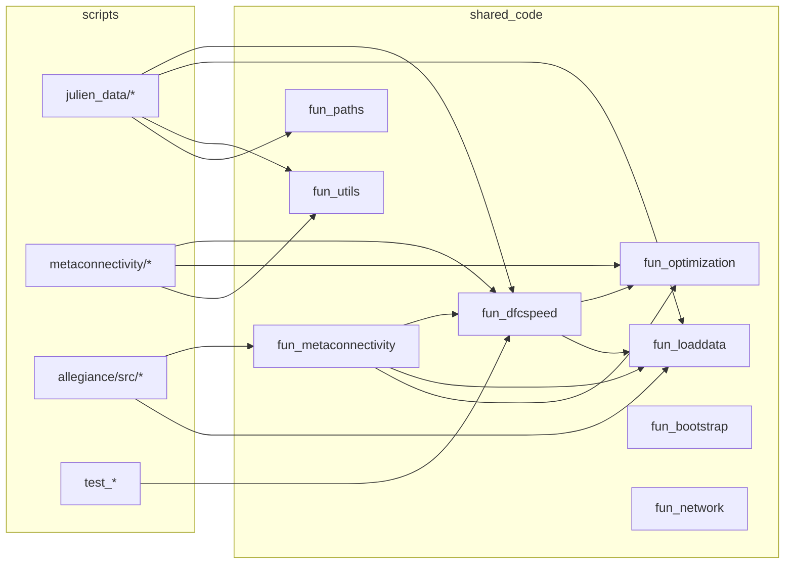

# Repository Inventory

Snapshot of structure, modules, entrypoints, large folders, and code metrics.

- Generated: 2025-09-01
- Root: `net_fluidity`

## Top-level Tree (selected)

```text
./
├─ allegiance/
├─ docs/
├─ julien_data/
├─ metaconnectivity/
├─ shared_code/
├─ .vscode/
└─ (no top-level notebooks/, scripts/, src/, data/, outputs/, reports/, config)
```

Presence of common folders:
- notebooks: missing
- scripts: missing
- shared_code: present
- src: missing
- data: missing
- outputs: missing
- reports: missing
- config: missing

## Key Packages & Modules

- shared_code (installable)
  - Modules: `fun_dfcspeed.py`, `fun_optimization.py`, `fun_utils.py`, `fun_loaddata.py`, `fun_paths.py`, `fun_metaconnectivity.py`, `fun_bootstrap.py`, `fun_network.py`, `__init__.py`

- src (top-level): not present
  - Note: `allegiance/src/` contains project-specific scripts (not an installable package)
    - Scripts: `allegiance_per_animal.py`, `allegiance_per_animal_v2.py`, `burst_detection_PBM.py`, `compute_allegiance_local.py`, `merge_allegiance_parallel.py`, `run_all_allegiance_local.py`, `1_preprocessed_data_ts_cog_groups.py`, `2_compute_dfc_local.py`, plus helpers

## Entrypoints & Notebooks

- Entrypoints (contain `if __name__ == "__main__"`)
  - `test_unified_dfc_speed.py`
  - `test_compatibility.py`
  - `test_dfc_speed_integration.py`
  - `julien_data/1_preprocess_data_ts_cog.py`
  - `julien_data/simple_speed_analysis.py`
  - `allegiance/src/merge_allegiance_parallel.py`

- Notebooks
  - `julien_data/plots_speed.ipynb`

## Large Data/Cache Dirs (>= 50MB)

- 483 MB — `allegiance/` (contains local `env/` and `src/`)
- 79 MB — `julien_data/` (scripts, figures, results)

## Dependency Graph (Mermaid)



## Longest .py Files (top 20)

| Lines | Path                                              |
|------:|---------------------------------------------------|
|  2517 | `julien_data/local_speed_plot_v2.py`              |
|  1486 | `julien_data/local_speed_plot.py`                 |
|  1396 | `julien_data/laod_las_speed.py`                   |
|  1255 | `allegiance/src/allegiance_per_animal_v2.py`      |
|  1037 | `julien_data/plot_cog_data.py`                    |
|  1007 | `julien_data/class_dataanalysis_julien.py`        |
|   925 | `allegiance/src/allegiance_per_animal.py`         |
|   841 | `shared_code/shared_code/fun_dfcspeed.py`         |
|   823 | `shared_code/shared_code/fun_metaconnectivity.py` |
|   769 | `metaconnectivity/fun_metaconnectivity.py`        |
|   630 | `julien_data/dfc_windows_pooling.py`              |
|   576 | `julien_data/3_dfc_local_speed_v1.py`             |
|   528 | `allegiance/src/burst_detection_PBM.py`           |
|   497 | `shared_code/shared_code/fun_utils.py`            |
|   439 | `metaconnectivity/fun_dfcspeed.py`                |
|   390 | `julien_data/3_dfc_speed_test_v6.py`              |
|   388 | `julien_data/test_func_speed.py`                  |
|   321 | `metaconnectivity/compute_trimers.py`             |
|   289 | `shared_code/shared_code/fun_loaddata.py`         |
|   288 | `shared_code/shared_code/fun_optimization.py`     |
