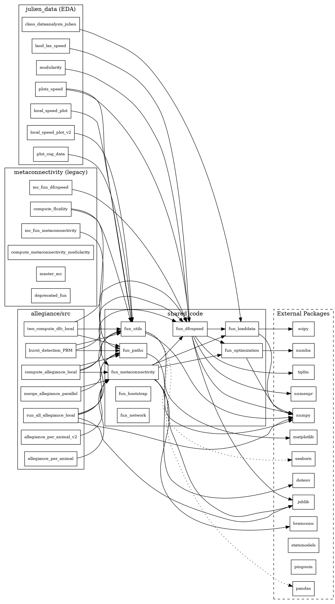

# Net Fluidity — Architecture Map and Refactor Plan

Generated by repository scan (Python, NumPy/Pandas/Matplotlib, HPC context w/ joblib; Numba optional).

## Module Map
- shared_code.fun_dfcspeed: DFC/FC computation, stream generation, speed metrics; entry via pipelines/tests.
- shared_code.fun_metaconnectivity: Meta-connectivity, allegiance communities, parallel compute/caching; used by allegiance/meta.
- shared_code.fun_optimization: Numba/NumExpr/NumPy-optimized correlation and speed; used by dfcspeed/metaconnectivity.
- shared_code.fun_loaddata: Load/save .npz/.pkl/.mat, cache helpers, filename conventions; used broadly.
- shared_code.fun_paths: Env-driven path resolution (PROJECT_ROOT_<ENV>), results/fig dirs; used broadly.
- shared_code.fun_utils: Plotting utils (rcParams), data transforms, logging helpers; used broadly.
- shared_code.fun_bootstrap / fun_network: Bootstrap/permutation; network helpers.
- allegiance/src/*: Orchestrates per-animal/window allegiance runs; entries: run_all_allegiance_local.py, 2_compute_dfc_local.py, merge_allegiance_parallel.py.
- metaconnectivity/*: Legacy/experimental MC and fluidity analyses; overlaps with shared_code.
- julien_data/*: Exploratory analysis/plot scripts (very large); manual runs.
- tools/*, scripts/*: Lint/dead-code reports, import guard, smoke runner.

## Dependency Graph (DOT)


## Dependency Graph (Mermaid)
```mermaid
graph LR
  subgraph External
    Numpy[numpy]; Pandas[pandas]; MPL[matplotlib]; Seaborn[seaborn]; SciPy[scipy]; Joblib[joblib]; TQDM[tqdm]; NumExpr[numexpr]; Numba[numba]; BrainConn[brainconn]; Statsmodels[statsmodels]; Pingouin[pingouin]; Dotenv[dotenv]
  end
  subgraph shared_code
    FDFC[fun_dfcspeed]; FMC[fun_metaconnectivity]; FOPT[fun_optimization]; FLOAD[fun_loaddata]; FPATH[fun_paths]; FUTIL[fun_utils]; FBOOT[fun_bootstrap]; FNET[fun_network]
  end
  subgraph allegiance/src
    RUNALL[run_all_allegiance_local]; DFC2[two_compute_dfc_local]; MERGE[merge_allegiance_parallel]; COMPLOC[compute_allegiance_local]; AANA[allegiance_per_animal]; AANA2[allegiance_per_animal_v2]; BURST[burst_detection_PBM]
  end
  subgraph metaconnectivity (legacy)
    LDFC[fun_dfcspeed]; LMC[fun_metaconnectivity]; FLUID[compute_fluidity]; MCMOD[compute_metaconnectivity_modularity]; MMC[master_mc]; DEPR[deprecated_fun]
  end
  subgraph julien_data (EDA)
    PLOTS[plots_speed]; LSP[local_speed_plot]; LSP2[local_speed_plot_v2]; LOADLAS[laod_las_speed]; PCOG[plot_cog_data]; CLASS[class_dataanalysis_julien]; MOD[modularity]
  end
  FDFC --> FOPT
  FDFC --> FLOAD
  FMC --> FDFC
  FMC --> FLOAD
  FMC --> FOPT
  FDFC --> Numpy
  FDFC --> NumExpr
  FDFC --> Joblib
  FDFC --> TQDM
  FOPT --> Numba
  FOPT --> Numpy
  FMC --> Numpy
  FMC --> Joblib
  FMC --> BrainConn
  FLOAD --> Numpy
  FLOAD --> SciPy
  FPATH --> Dotenv
  FUTIL --> MPL
  FUTIL -.-> Seaborn
  FUTIL -.-> Pandas
  RUNALL --> FMC
  RUNALL --> FPATH
  RUNALL --> FUTIL
  DFC2 --> FDFC
  DFC2 --> FPATH
  DFC2 --> FUTIL
  MERGE --> FMC
  MERGE --> FPATH
  COMPLOC --> FDFC
  COMPLOC --> FMC
  COMPLOC --> FPATH
  COMPLOC --> FUTIL
  AANA --> FMC
  AANA2 --> FMC
  BURST --> FDFC
  BURST --> FPATH
  BURST --> FUTIL
  LDFC --> FDFC
  LMC --> FMC
  FLUID --> FUTIL
  FLUID --> FPATH
  PLOTS --> FDFC
  PLOTS --> FUTIL
  LSP --> FUTIL
  LSP2 --> FUTIL
  LOADLAS --> FDFC
  PCOG --> FUTIL
  CLASS --> FLOAD
  MOD --> FDFC
  RUNALL --> Joblib
  RUNALL --> Numpy
```

## Top 10 Hotspots (risk rationale)
1) julien_data/plots_speed.py (16,350 LOC): monolithic EDA/plotting; global plotting state; minimal tests.
2) julien_data/local_speed_plot_v2.py (3,009 LOC): large mixed analysis; limited coverage.
3) julien_data/laod_las_speed.py (1,742 LOC): data/analysis blend; path assumptions.
4) julien_data/local_speed_plot.py (1,728 LOC): duplicate logic vs v2; divergence risk.
5) allegiance/src/allegiance_per_animal_v2.py (1,500 LOC): orchestration + stats; parallel/IO interleaved.
6) julien_data/plot_cog_data.py (1,201 LOC): heavy plotting/wrangling; likely low tests.
7) julien_data/class_dataanalysis_julien.py (1,044 LOC): mixed responsibilities; hidden state risk.
8) allegiance/src/allegiance_per_animal.py (1,002 LOC): older variant; duplication vs v2.
9) shared_code/shared_code/fun_dfcspeed.py (904 LOC): core compute; perf-sensitive; broad API.
10) shared_code/shared_code/fun_metaconnectivity.py (902 LOC): core MC/allegiance; parallel + caching.

## Architecture Smells
- Tight coupling to filesystem/env (PROJECT_ROOT_<ENV>, dataset names); on-disk cache assumptions.
- Hidden global state: rcParams, env mutation, import-time logging.
- God scripts: large EDA and allegiance files mixing IO/compute/plot/orchestration.
- Duplication/divergence: legacy metaconnectivity vs shared_code; redefined get_paths.
- Leaky package boundary: star re-exports in shared_code.__init__; import path inconsistencies.
- Debug artifacts: prints in library functions; commented code blocks.
- Weak CLIs: multiple ad-hoc __main__ scripts; overlapping args.
- Parallelism hazards: joblib oversubscription; heavy IO; no SLURM integration.
- Caching risks: unversioned .npz/.pkl; stale data risk.
- Testing gaps: limited unit tests for numerics/edges; reliance on smoke.

## Executive Summary (10 lines)
- shared_code forms the stable core for FC/DFC/MC, IO, paths, and utils.
- Allegiance pipeline orchestrates per-animal/window jobs and merges temp outputs.
- Legacy metaconnectivity and julien_data host large, overlapping, exploratory scripts.
- Scientific stack plus optional Numba/NumExpr; brainconn/statsmodels for network/stats.
- Configuration is env/filesystem-centric; standardize PROJECT_ROOT_<ENV> and dataset names.
- Core compute modules are performance-critical—need focused tests and benchmarks.
- Monolithic EDA scripts dominate risk; refactor into importable modules/notebooks.
- Joblib parallelism lacks SLURM integration; unify submission and resource control.
- Caches are unversioned; introduce schema/versioning and invalidation policies.
- Priorities: consolidate legacy code, define a CLI, remove globals, improve tests/docs.

## Phased Refactor Plan
- Phase 0 — Foundations: Central settings (env/pydantic), freeze shared_code API (explicit exports), strict import checks in pre-commit.
- Phase 1 — De-monolith Core: Split fun_dfcspeed into fc.py (FC/DFC), speed.py (metrics), stream.py (windowing); remove side effects; add types/docstrings.
- Phase 2 — Consolidate Meta: Merge needed legacy functions into shared_code.fun_metaconnectivity; deprecate metaconnectivity/* behind flags.
- Phase 3 — Orchestration CLI: Add net_fluidity.cli (typer/click) with dfc/mc/allegiance/merge subcommands; unify args/logging/cache/versioning.
- Phase 4 — SLURM/HPC: slurm/submit.py to render sbatch/arrays; resource presets; ensure joblib ≤ allocated cores; no nohup.
- Phase 5 — Caching/Versioning: Standardize .npz schema and version tag; content-hash manifests; graceful invalidation.
- Phase 6 — Tests/Benchmarks: Unit tests for FC/DFC/speed edge cases; golden numerics vs NumPy/Scipy; perf benchmarks for numba paths; CI smoke.
- Phase 7 — EDA Extraction: Move reusable logic from julien_data into shared_code.analysis; convert scripts to notebooks; remove duplicates.
- Phase 8 — Logging/Plots: Context-managed rcParams; centralized logger config; non-interactive backends in lib code; no import-time side effects.
- Phase 9 — Docs/Usage: Repo map, CLI usage, env vars, data layout, SLURM recipes; include diagrams in README/docs.

## Next Steps
- Approve Phase 0–1 scope; I can scaffold the package splits and CLI skeleton, and add import guards and minimal tests.

## Implementation TODOs
- [ ] Phase 0 — Foundations (settings, explicit exports, pre-commit import checks)
- [ ] Phase 1 — De-monolith Core (split dfcspeed into fc/speed/stream; add types/docs)
- [ ] Phase 2 — Consolidate Meta (merge legacy into shared_code; deprecate old modules)
- [ ] Phase 3 — Orchestration CLI (dfc/mc/allegiance/merge; unified logging/cache)
- [ ] Phase 4 — SLURM/HPC (sbatch/array generation; resource presets; joblib limits)
- [ ] Phase 5 — Caching/Versioning (.npz schema + version; content-hash manifest)
- [ ] Phase 6 — Tests/Benchmarks (unit + golden numerics; perf for numba paths; CI)
- [ ] Phase 7 — EDA Extraction (move reusable logic; convert scripts to notebooks)
- [ ] Phase 8 — Logging/Plots (rcParams contexts; centralized logging; no import effects)
- [ ] Phase 9 — Docs/Usage (repo map, CLI, env vars, data layout, SLURM recipes)
